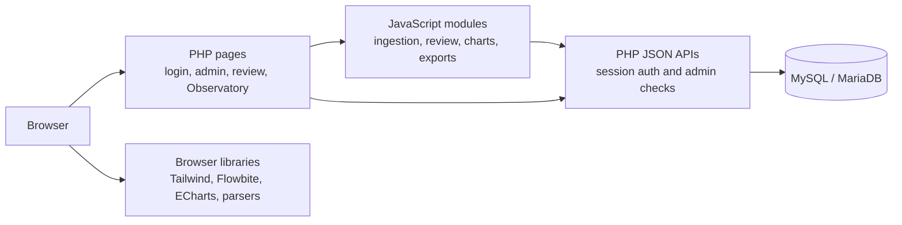

# IRIS

**IRIS (International Rapport Insight System)** is the CLSU International Affairs Office's institutional performance data and observatory application. It combines structured ranking and program data, reviewed file ingestion, saved analytics, and a user-facing Observatory.

IRIS is a plain-PHP application. Apache serves PHP pages and PDO-backed APIs; browser JavaScript handles interactive workflows, file parsing, and charts. There is no Laravel application, Composer runtime, Node.js web server, or Python service.

## V6.7.0 Highlight

V6.7.0 improves template-driven office uploads and Ranking History: Super Admins can preview saved workbooks, custom ranking context is preserved, empty import rows are skipped, and blocked mappings identify the source column. The Observatory separates explanatory ranking context from information details and removes the published-graph count badge. See [README_V6.7.0.md](docs/releases/README_V6.7.0.md) for changes, required migrations, and verification.

The Super Admin header logo opens the public Observatory; use the explicit admin navigation and menu for management pages.

## What the System Does

- Presents institutional rankings, ranking breakdowns, college contributions, program results, and accreditation data.
- Lets administrators import structured CSV rows into the institutional database through a reviewable staging workflow.
- Provides a Scanner for spreadsheet ingestion, extracted-data review, editable tables, and chart drafting.
- Stores records, saved graph configurations, and manually managed performance snapshot cards in MySQL.
- Provides Super Admin record merge, File History, and restore tools in File Archives.
- Supports template-defined custom import fields for Summary Cards and Ranking History.
- Publishes selected graphs and snapshot cards to the Observatory without conflating graph publication with record approval.
- Provides authentication, user/admin roles, record management, graph exports, and print views.

## Roles and Access

- **User:** registers with a CLSU email address, waits for Super Admin activation, then signs in to read the Observatory.
- **Admin:** has all user access plus office uploads and the File Ingestion dashboard.
- **Super Admin:** manages accounts, templates, ranking bodies, review workflows, ranking history, summary cards, saved graphs, record merges, and File History.

Public registration creates only an inactive `user` account. The existing `users.is_active` flag and Super Admin account manager provide manual activation; there is no separate pending-approval state, so an inactive registration cannot be distinguished from a deactivated account. Registration does not grant office or Super Admin privileges. PHP session authentication protects the Observatory and APIs; mutations use role checks and CSRF tokens. Do not expose local database credentials in a deployed environment.

## Main Areas

| Area | Entry point | Purpose |
| --- | --- | --- |
| Application router | `index.php` | Redirects signed-in users to the Observatory or admins to File Ingestion; otherwise opens login. |
| Observatory | `user/dashboard.php` | Displays institutional analytics, published snapshot cards, and Scanner-published graphs. Admins also see editing and unpublish controls. |
| File Ingestion | `admin/dashboard.php` | Accepts Scanner spreadsheet uploads and shows parsed records for review. |
| Review Editor | `admin/review_editor.php` | Reviews records, edits extracted cells and chart mappings, saves records, and publishes the active Studio chart. |
| Template Imports | Review Editor import controls | Previews office spreadsheets, maps fields through Super Admin profiles, and requires an explicit diff review before writes. |
| Smart Upload | `admin/smart_upload.php` | Maps supported structured CSV headers into staging rows for the institutional tables. |
| Extraction Review | `admin/review_extraction.php` | Lets an admin inspect, edit, and select mapped rows before the Smart Upload database transaction. |
| Saved Graphs | `admin/saved_graphs.php` | Lists saved chart versions and supports per-graph or selected-graph publishing, export, printing, and deletion. |
| File Archives | `admin/file_archives.php` and the admin File Archives tab | Filters imported records and provides role-gated merge, history, download, and restore actions. |
| Scanner workspace | `scanner/index.php` | Provides browser-based ingestion, extraction overview, document/data viewing, draft charts, and links to the admin and Observatory. |

## Project map

- `admin/`, `auth/`, and `user/` contain the stable PHP page entry points for administration, authentication, and the Observatory.
- `api/` contains HTTP endpoints. The `api/iris.php` router loads shared helpers from `includes/api/common.php` and dispatches each resource to `includes/api/handlers/`.
- `includes/` contains shared PHP functions, configuration, data and upload helpers, navigation partials, and page snippets.
- `scanner/` contains the Scanner entry point, styles, vendor assets, and browser code. `scanner/js/modules/` contains ES modules; the other `scanner/js/` folders group classic scripts by purpose.
- `docs/` contains project notes; version-specific release notes are in `docs/releases/`.

Typical request flow: a page entry point loads its PHP includes and ordered assets, browser interactions call an endpoint under `api/`, and `api/iris.php` performs its authentication/role/CSRF gates before including the matching handler.

## Data Workflows

### Structured Institutional CSV

1. An admin uploads a CSV in Smart Upload.
2. Rule-based mapping checks the headers and stages recognized rows in the PHP session; it does not write them automatically.
3. The admin reviews and selects rows in the extraction review page.
4. Confirmation inserts the selected ranking, breakdown, college, program, and/or accreditation rows in a MySQL transaction and adds an `uploads_log` entry.

### Scanner Record and Chart

1. An admin selects a CSV, XLS, or XLSX in the Scanner. The browser validates a 10 MB per-file limit and parses the workbook locally; raw Scanner files are not submitted to a PHP upload endpoint.
2. The parsed content creates an editable pending record. Handoff between admin pages uses IndexedDB; record persistence is performed through the PHP API.
3. The Review Editor can update record fields, extracted data, notes, and chart configuration. Save keeps the record in its selected review status and leaves the active graph unpublished.
4. Studio Publish sets `records.status` to `Approved` and saves the active chart with `saved_graphs.is_published = 1`. It does not publish every saved graph belonging to that record.
5. The archive can publish or unpublish selected records in bulk. File-level Unpublish returns the record to `Pending Review` and hides every saved graph linked by `record_id`; it does not delete either the record or its charts.

### Office Upload Destinations

Office users choose **Data and Report Visualization**, **Summary Cards**, or **Ranking History** before uploading a spreadsheet. General visualization uploads require an active analytics template and enter the regular record-review and charting workflow. Summary Card and Ranking History uploads use their active import profiles and remain separated from the general Review Editor dataset.

Office spreadsheets and Super Admin template/profile workbooks are multipart uploads. Their PHP endpoints enforce the shared 10 MB byte limit, check PHP upload error codes, whitelist file extensions, and validate MIME/signature content. Star-rating logos retain their stricter 1 MB limit. Scanner selections are browser-parsed and use the same configured client-side 10 MB threshold; the original selected file is not posted to PHP.

The template-import processor retains a separate 100 MB ceiling only when reading already-stored legacy record workbooks. It does not permit new uploads above the shared 10 MB limit.

Super Admin import profiles can define labeled custom fields and map additional workbook columns to them. Those values are preserved with supported Ranking History and Summary Card imports. Apply the custom-field storage migration before enabling these mappings.

Parser and viewer modules for PDF, DOCX, and image OCR are present in the codebase, but the current Scanner upload widget accepts spreadsheets only. Smart Upload currently performs rule-based mapping for CSV files.

### Saved Graph Publish and Unpublish

- Saved Graphs Publish sends the selected graph IDs to the authenticated graph API and changes only those graph rows.
- Observatory Unpublish changes the same graph's publication flag back to false. The chart remains saved and can be published again.
- Archive file-level Unpublish resets one record to `Pending Review` and unpublishes all of its linked saved graphs. Bulk Publish/Unpublish applies the same record-and-chart behavior to each selected record in a single database transaction.
- Public Data & Report Visualization includes only saved graph rows whose `is_published` value is true. Its endpoint sends no-cache headers so state changes appear after refresh.

### Performance Snapshot Cards

Snapshot cards are maintained separately from Scanner graphs. Their title, values, labels, year, description, display order, precision, and publication state are stored in `summary_cards`. Publishing or unpublishing a card does not change records or saved graphs.

The Unified Summary Cards profile maps office spreadsheet headers to Summary Card fields, including Global Label (`summary_cards.import_key`), reporting period, card content, optional categories, and display precision. Imports compare every incoming period against database history. Older imports are backfills; only the latest explicitly published snapshot is public/current. New periods remain unpublished until an administrator publishes them. Blank cells preserve values; `__CLEAR__` explicitly clears a field. The Summary Card history manager supports correction, publication, provenance inspection, and read-only public history.

Super Admins can create and manage categories, set the public default category, and manage cards in a dialog in Review Editor. The default selector lists all categories but only allows saving a category that has at least one published card.

Ranking History imports match the full ranking identity, display a side-by-side preview, and reject ambiguous matches. The Super Admin must acknowledge the diff before applying selected rows. Optimistic row versions prevent applying stale previews.

After successful database writes, open IRIS pages refresh automatically. Super Admin tabs synchronize promptly; other roles poll every five seconds. Pages with unsaved edits defer refresh and offer a manual refresh action.

### File Archives and Record Merge

Super Admins can compare two compatible spreadsheet records, explicitly select the source to merge and the surviving target, and review a preview before applying the merge. File History captures pre-merge and post-merge snapshots and keeps supported original workbooks in private upload storage. Authorized administrators can inspect/download versions and restore one while recording the pre-restore and restored states. The File History table migration is required before these actions are available.

## Important Publication Rules

Publication and record review are distinct:

- `records.status` describes record review (`Pending Review`, `Approved`, or `Needs Revision`).
- `saved_graphs.is_published` controls whether a graph appears in Data & Report Visualization.
- `summary_cards.is_published` controls whether a snapshot card appears in the Observatory.

Approving a record does not implicitly publish its saved graphs. The public graph query filters by the graph flag; publication is never inferred from record approval.

## Architecture and Data

### Runtime

- **Server:** Apache with PHP 8.1+ and PDO.
- **Database:** MySQL 8/InnoDB, database name `iris_db_3nf`.
- **Frontend:** browser JavaScript modules and CSS. Pages load Tailwind, Flowbite, Font Awesome, ECharts, and parser libraries from CDNs, so the browser needs access to those hosts.
- **Tests:** Node.js is optional and is used only for the dependency-free test suite.

### System Architecture

The application is a server-rendered PHP site with browser-side modules. PHP owns authentication, authorization, validation, and MySQL transactions; JavaScript owns interactive page behavior, spreadsheet parsing, editing, and chart rendering. The browser talks directly to the PHP JSON API rather than to a separate Node service.



| Component | Responsibility |
| --- | --- |
| `index.php`, `auth/` | Route users into the application and manage login, registration, and PHP sessions. |
| `admin/` | Provide ingestion, review, Smart Upload, extraction review, and saved-graph management pages. |
| `scanner/js/` | Run browser workflows and call the PHP API through `DatabaseManager`; parsing and charting happen client-side. |
| `api/iris.php` | Authenticate record and graph reads; require admin authorization for mutations; persist changes using PDO. |
| `api/dashboard_graphs.php`, `api/summary.php` | Supply Observatory graph/card data and authenticated summary data. |
| `config/db.php`, `database.sql` | Configure the normalized PDO connection; `database.sql` is retained only as a legacy schema reference. |
| `user/dashboard.php` | Render institutional analytics and only explicitly published Scanner graphs and summary cards. |

For Scanner publication, a record is linked to its charts by `saved_graphs.record_id`. Record-level unpublishing changes `records.status` and the linked charts' `is_published` flags together. Summary cards are independent rows in `summary_cards` and are not associated with a Scanner file.

### Main Data Tables

| Table | Contents |
| --- | --- |
| `users` | Login identity, password hash, and `user`/`admin` role. |
| `ranking_bodies` | Ranking publisher catalog (QS, THE, WURI, and others). |
| `rankings` | Yearly global/national ranking values, categories, and notes. Original rank text is retained alongside derived numeric values. |
| `ranking_breakdowns` | Per-body, per-year items such as THE Impact SDGs or WURI categories. |
| `colleges` | College contribution metrics by year. |
| `programs` | College-linked program rank, score, movement, and year. |
| `accreditations` | Program-level assessment criteria, text scores, and optional numeric scores. |
| `uploads_log` | Admin CSV import filename, type, inserted row count, and uploader. |
| `records` | Scanner file metadata, extracted data, review status, notes, and draft metadata. |
| `saved_graphs` | Saved ECharts configuration/data linked to a record; `is_published` is the public visibility flag. |
| `summary_cards` | Independently managed Observatory snapshot cards and publication settings. |
| `template_import_profiles` | Super Admin mappings, required fields, and defaults for office spreadsheet imports. |
| `summary_card_snapshots` | Historical values for imported summary-card periods. |
| `record_file_history` | Append-only record merge and restore snapshots, with references and checksums for private workbook copies. |
| `import_batches`, `import_batch_rows` | Import audit records used to revert an applied batch. |
| `app_change_state` | Shared write version polled by active pages for refresh synchronization. |

The runtime uses the normalized `iris_db_3nf` schema. `database.sql` and migrations that select `iris_db` describe the retired denormalized schema and must not be imported or applied to the normalized database. `config/db.php` only opens the configured PDO connection and tracks application writes; it does not create or alter tables.

## API Map

`api/iris.php` is the session-authenticated JSON API. Mutating requests additionally require an admin role.

| Route | Purpose |
| --- | --- |
| `GET /api/iris.php?resource=records` | List Scanner records. |
| `POST /api/iris.php?resource=records` | Create a Scanner record. |
| `GET /api/iris.php?resource=records&id={recordId}` | Read one record. |
| `PUT /api/iris.php?resource=records&id={recordId}` | Update record fields and review status. |
| `DELETE /api/iris.php?resource=records&id={recordId}` | Delete a record and its linked saved graphs. |
| `POST /api/iris.php?resource=records&action=bulk-approve` | Approve selected records; does not publish their graphs. |
| `POST /api/iris.php?resource=records&id={recordId}&action=unpublish` | Return one record to Pending Review and unpublish all linked saved graphs. |
| `POST /api/iris.php?resource=records&action=bulk-publish` | Publish selected records and their linked saved graphs transactionally. |
| `POST /api/iris.php?resource=records&action=bulk-unpublish` | Return selected records to Pending Review and unpublish their linked graphs transactionally. |
| `POST /api/iris.php?resource=records&action=preview-record-merge` | Validate and preview a source-to-target spreadsheet merge. Super Admin only. |
| `POST /api/iris.php?resource=records&action=merge-records` | Apply an explicitly directed merge and create File History snapshots. Super Admin only. |
| `GET /api/iris.php?resource=record_file_history&action=list&record_id={recordId}` | List File History entries for a record or merge pair. Admin authenticated. |
| `GET /api/iris.php?resource=record_file_history&action=version&id={versionId}` | Read an archived record snapshot. Admin authenticated. |
| `GET /api/iris.php?resource=record_file_history&action=download&id={versionId}` | Download an archived source workbook. Admin authenticated. |
| `POST /api/iris.php?resource=record_file_history&action=restore&id={versionId}` | Restore an archived record version and append restore history. Admin authenticated. |
| `GET /api/iris.php?resource=graphs` | List saved graphs. |
| `POST /api/iris.php?resource=graphs` | Save a graph and its chart data. |
| `POST /api/iris.php?resource=graphs&id={graphId}&action=publish` | Set one graph's `is_published` flag to true. |
| `POST /api/iris.php?resource=graphs&id={graphId}&action=unpublish` | Set one graph's `is_published` flag to false. |
| `GET /api/iris.php?resource=graphs&record_id={recordId}` | List graphs for one source record. |
| `POST /api/iris.php?resource=graphs&action=export` | Export selected saved graph data. |
| `GET /api/iris.php?resource=summary_cards` | List snapshot cards for the admin interface. |
| `POST/PUT/DELETE /api/iris.php?resource=summary_cards[&id={cardId}]` | Create, update, or delete snapshot cards. |
| `GET /api/dashboard_graphs.php` | Read-only Observatory feed containing explicitly published graphs and cards; response is non-cacheable. |
| `GET /api/summary.php` | Return an authenticated narrative summary based on stored institutional data. |
| `GET /api/change_signal.php` | Return the authenticated app data version used by active-page refresh polling. |
| `GET/POST /api/templates.php` | Read templates and manage Super Admin import profiles. |
| `POST /api/imports/summary_card_import.php` | Preview or apply template-driven summary-card imports. |
| `POST /api/imports/ranking_history_import.php` | Preview or apply template-driven ranking history imports. |
| `POST /api/imports/import_recovery.php` | Revert an audited import batch when its rows are unchanged since application. |
| `GET /api/iris.php?resource=summary_card_history&id={cardId}` | Read published period history; Super Admin can request `view=admin` for all periods. |
| `POST /api/iris.php?resource=summary_card_history&id={cardId}` | Correct a period or explicitly publish/unpublish it with optimistic locking. |

Graph publish/unpublish requests send JSON such as `{ "published": true }` or `{ "published": false }`. The API responds with the graph ID and the resulting publication state. Browser persistence is managed by `scanner/js/database/dbManager.js`; MySQL is canonical when the PHP API is available.

## Local Setup (XAMPP)

1. Place or clone the repository under `C:/xampp/htdocs/iris` (or another Apache document-root subdirectory).
2. Start Apache and MySQL from the XAMPP Control Panel.
3. Provision the supplied normalized schema and any required transformed data into `iris_db_3nf` before starting the application. Do not import [`database.sql`](database.sql) or run historical migrations that select `iris_db`; those describe the retired denormalized schema.
4. Apply only reviewed migrations documented for `iris_db_3nf`. V6.7.0 schema changes are provided in [`20261003_create_record_file_history.sql`](migrations/20261003_create_record_file_history.sql), [`20261003_ranking_history_published_flag.sql`](migrations/20261003_ranking_history_published_flag.sql), [`20261003_template_destination.sql`](migrations/20261003_template_destination.sql), [`20261003_template_profile_workbooks.sql`](migrations/20261003_template_profile_workbooks.sql), [`20261005_custom_import_fields.sql`](migrations/20261005_custom_import_fields.sql), and [`20261006_expand_ranking_context_text.sql`](migrations/20261006_expand_ranking_context_text.sql). Review each migration against the deployed schema, back up the database, and apply only migrations not already reflected in it. The application bootstrap does not create or alter tables.
5. Set `IRIS_DB_HOST`, `IRIS_DB_PORT`, `IRIS_DB_NAME`, `IRIS_DB_USER`, and `IRIS_DB_PASS` in [`config/db.php`](config/db.php) for the environment. The current defaults are intended for local XAMPP development, not production.
6. Configure PHP uploads to `upload_max_filesize = 10M` and `post_max_size = 12M`. The repository `.user.ini` supplies these values for CGI/FastCGI PHP; for Laragon/XAMPP Apache mod_php, set them in the active PHP `php.ini` instead and restart Apache. The office upload and template endpoints also enforce a 10 MB limit in application code.
7. Provision the initial active `super_admin` account through the deployment's secure account-bootstrap process. Public registration is available for normal users only and remains inactive pending Super Admin activation. Super Admins can manage subsequent Admin and User accounts from the application.
8. Open the application under its Apache document-root URL and sign in. The application root redirects signed-in users according to their normalized role.

For production, configure a least-privilege MySQL account, a non-default password, HTTPS, and a reviewed migration process appropriate to the deployment. Runtime database credentials need no schema-creation or schema-alter privileges.

## Repository Map

```text
auth/                    Registration, login, logout, and PHP sessions
admin/                   File intake, record review, File Archives, Smart Upload, saved graphs
api/                     Authenticated IRIS API and Observatory read endpoints
config/db.php            PDO connection and Scanner schema compatibility setup
includes/                Authentication, rank helpers, extractors, data inserts
scanner/index.php        Authenticated Scanner application shell
scanner/js/              Browser app, charting, persistence, modules, parsers
scanner/css/             Scanner styles
scanner/test/            Dependency-free Node tests
user/dashboard.php       Signed-in Observatory interface
database.sql             Legacy schema reference; do not import for V5.7.0
```

## Tests

Node.js is not required to run the PHP application. To run the browser-logic and source-contract tests from the repository root:

```powershell
node --test scanner/test/*.test.js
```

The suite covers graph/chart mapping, record merge/File History behavior, table filtering, document pagination, graph exports, publication wiring, and UI contracts. PHP-specific File History and workbook-mapping checks are separate commands. Tests do not replace an authenticated browser smoke test against Apache/MySQL for login, upload, persistence, or publish/unpublish behavior. See [`scanner/test/README.md`](scanner/test/README.md) for test coverage details.

## Related Documentation

- [`README_PHP.md`](docs/README_PHP.md): PHP deployment notes.
- [`README_V6.7.0.md`](docs/releases/README_V6.7.0.md): current release changes, migrations, and verification.
- [`README_V5.7.0.md`](docs/releases/README_V5.7.0.md): V5.7.0 release changes, migrations, and verification.
- [`README_V5.3.0.md`](docs/releases/README_V5.3.0.md): V5.3.0 release changes and migration steps.
- [`README_V4.5.0.md`](docs/releases/README_V4.5.0.md): V4.5.0 release changes and migration steps.
- [`README_V3.4.7.md`](docs/releases/README_V3.4.7.md): Historical V3.4.7 release details.
- [`README_V3.4.5.md`](docs/releases/README_V3.4.5.md): Historical V3.4.5 release notes.
- [`scanner/js/ai/README.md`](scanner/js/ai/README.md): chart suggestions and shared chart utilities.
- [`scanner/js/database/README.md`](scanner/js/database/README.md): persistence and API routes.
- [`scanner/js/modules/README.md`](scanner/js/modules/README.md): browser module responsibilities.
- [`scanner/test/README.md`](scanner/test/README.md): automated test commands and coverage.